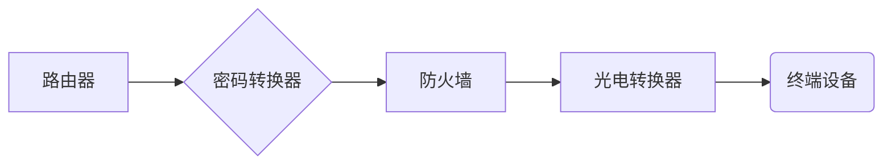
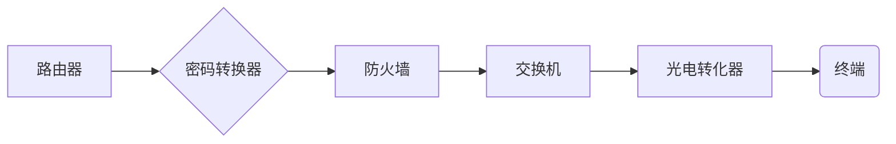
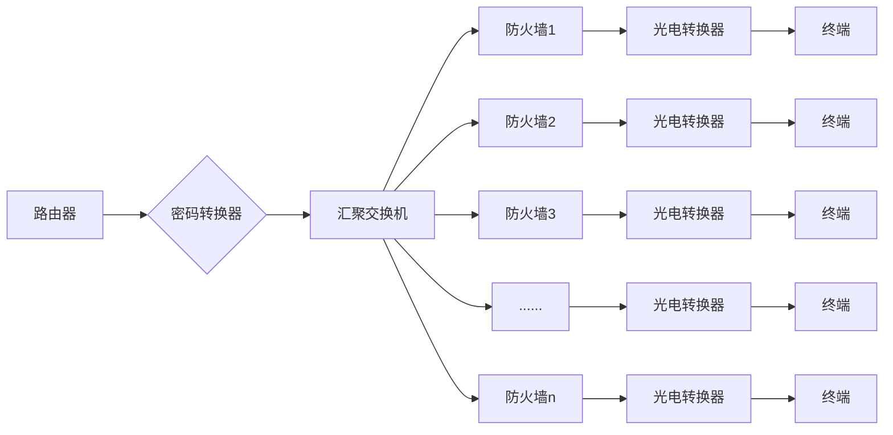
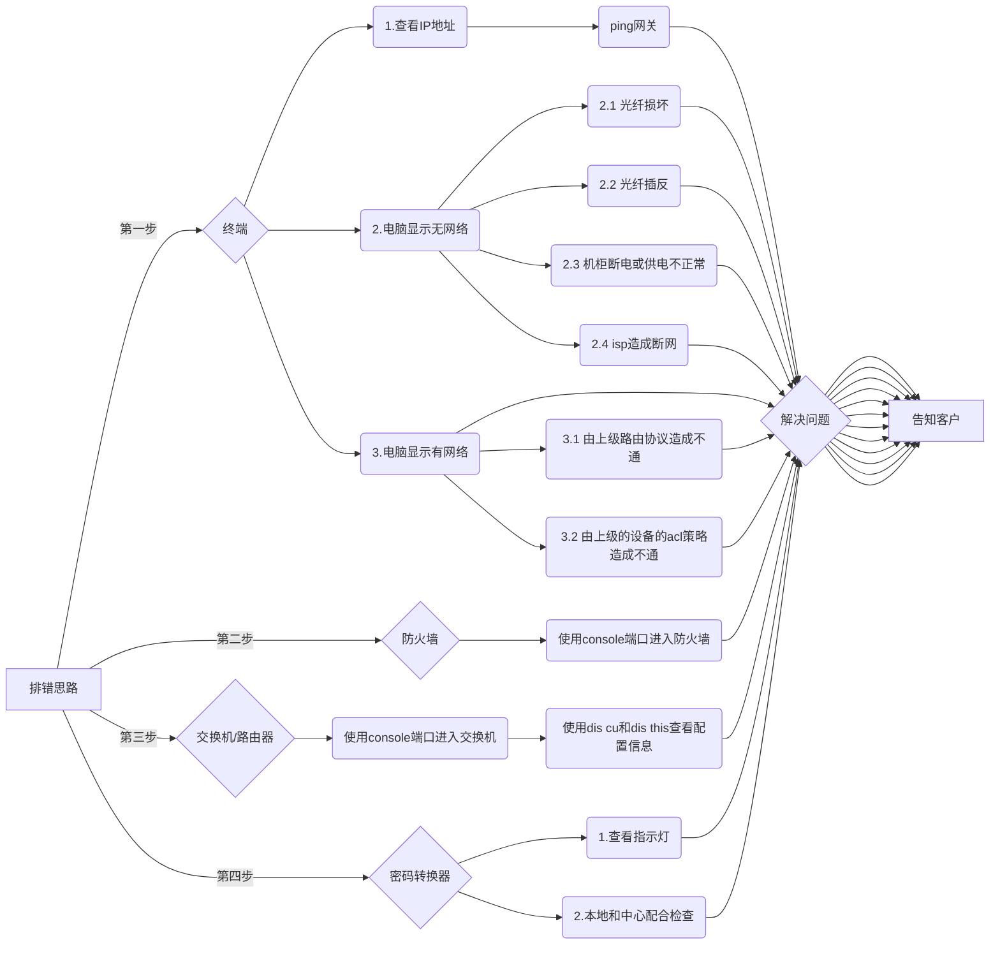

# 内部网络非管理中心排错

##  一、网络架构

## 1.单区域图



<center>第一种类型</center>




<center>第二种类型</center>

## 2.共享区域




##  二、关于终端的排错

### 1.查看IP地址

在Linux终端（命令界面）使用：

```shell
Linux# ip addr
或者
Linux# ifconfig
```

### 2.使用命令ping所在网络的网关：

```shell
格式：
	Linux# ping  IP地址
例如：
	Linux# ping 192.168.1.1
注意：
	网关就是你的终端的IP地址的最后一位改为1.
	例如：
		终端的IP地址是：192.168.2.8
		那么网关的IP地址就是：192.168.2.1
```

### 3.电脑网络图标显示无网络

```shell
(1)光纤损坏
	看电脑主机后的光纤口灯是否亮。
(2)光纤可能插反
	看电脑主机后的光纤口灯是否亮，如果没有亮那就把两根光纤换一下位置，看灯是否亮
(3)机柜断电，导致断网
	机柜断电，导致防火墙、光电转换器没电，这时候需要打开机柜确认。
(4)ISP运营商造成的断网
	在上诉排错方案都使用了，无法判断网络问题，那么要考虑是否是运营商提供的网络的问题！
	情况如下：
		查看运营商的光电转换器指示灯的是否正常，正常情况下是绿色的，如果出现红色或者其他颜色，则是运营商网络链路的问题。
	
	
	

```

### 4.电脑图标显示有网络，但是无法访问相关的网站

```shell
(1)可能是策略某些导致不通，怎么判断不是本身电脑的问题
	打开机柜，发现运营商提供光电转换器五个灯只有四个灯亮绿灯，剩下一个灯不亮，也不闪。这就说明当前网络链路中没有流量通过。这就有可能是交换机和防火墙的策略问题。
	
```

## 三、机柜设备故障问题

### 1.防火墙故障排错

```shell
	因网络安全要求，我们所管辖的网御星云和启明星辰的防火墙都统统关闭了非在用的物理接口，所以本地排错只能借助cosole端口，但是这个端口需要使用命令进行配置。
	具体配置使用的命令：
		略
```

### 2.交换机/路由器故障排错

```shell
(1)排错须知：
	首先，因网络安全需求，我们所管辖的交换机/路由器设备都关闭了非在用的物理端口，同时交换机的管理端口（即Meth端口）也是处于关闭状态，目前能用的只有console端口，这个端口必须要使用"串口线"进行连接。
(2)console端口连接需要配置的参数
	在这里我们需要使用远程软件（如CRT或者是xshell软件）进行连接，连接的时候我们需要设置：（这里我们用xshell软件举例）
		1.打开远程软件，选择"文件"下拉菜单，选择"新建"按钮
		2.在新建的对话框中的 "协议"选项中，选择"serial"，然后Baud rate（波特率）选择"9600"。
(3)进入交换机/路由器之后，使用"dis this"查看我们配置的命令，使用"dis cu"查看交换机所有的配置。
```


### 3.密码转换器故障排错

```shel
	密码转换器是一个加密设备，它发生故障将会导致它下面的所有设备故障。我们怎么进行排错呢？
		第一步，要查看密码转换器的工作指示灯是否正常，即查看指示灯的颜色是否正常，一般情况下指示灯都是呈现绿色状态。
		第二步，验证是否是密码转换器的故障，在这里需要通过网络控制中心配合检查密码转换器以上的设备，本地排错人员检查密码机以下的设备。
```


## 四、整体排错思路

```shell
	根据行业原则，路由器/交换机，乃至防火墙等设备，在配置好了之后，只要没有人去变更配置，逻辑上的东西（配置）是不会自己发生改变的，一般只会存在物理上的东西出现损坏。这个物理损坏也分了两种情况：
		（1）人为因素损坏，因为机柜保护等原因，人为损坏主要集中在终端设备及光纤上。
		（2）自然因素损坏，自然因素损坏主要集中在机柜里面的设备。
		
	结论：在排错的时候，要首先考虑终端和通信线路的故障，由终端向机柜里面的设备延申，直到核心层网络。
	
	流程图如下：
```



