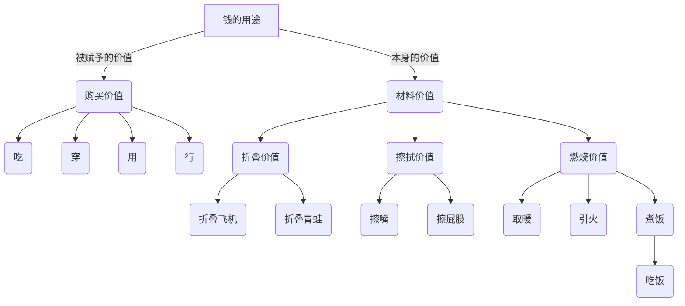

# 第一章 导图的作用
{: id="20210608121041-79bkzw5"}

## 什么是思维导图
{: id="20210608121041-sy1eg7d"}

&ensp;思维导图就像是大脑的使用说明树，也像是指引我们思考方向的一张地图。
{: id="20210608121041-5w9uopz"}

&ensp;本书的作者其代表作偶：《思维导图》《超级记忆》《开动大脑》《博赞学习技巧》《快速阅读》等
{: id="20210608121041-e7t1ny6"}

## 思维导图的几大功能
{: id="20210608121041-lj3xdgd"}

&ensp;思维导图有以下几大功能：明确方向、把握全局、理清关系。
{: id="20210608121041-kpayytu"}

## 第一天 学会发散思维
{: id="20210608121041-w9taxg7"}

&ensp;学会用思维导图，指导大脑更加地进行发散式思维。
{: id="20210608121041-lfi9xp5"}

&ensp;学习思维导图，不是为了图，而是为了思维。
{: id="20210608121041-np7lj6j"}

## 第一章的课后作业：
{: id="20210608121041-8wtrfa4" updated="20210608140715"}

{: id="20210608121041-9u1j26l"}

{: id="20210608140657-38qrdlw"}

{: id="20210608121041-wvlsiye" type="doc"}
