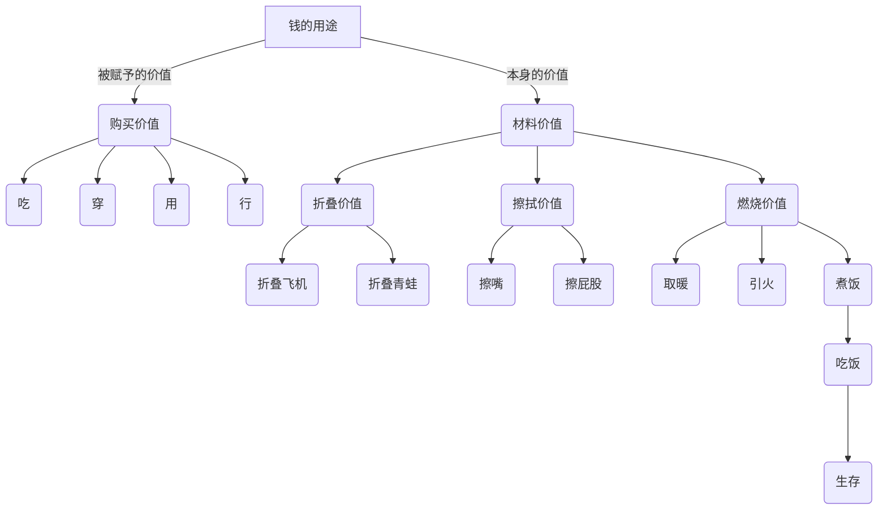

# 第一章 导图的作用

## 什么是思维导图

&ensp;思维导图就像是大脑的使用说明树，也像是指引我们思考方向的一张地图。

&ensp;本书的作者其代表作偶：《思维导图》《超级记忆》《开动大脑》《博赞学习技巧》《快速阅读》等

## 思维导图的几大功能

&ensp;思维导图有以下几大功能：明确方向、把握全局、理清关系。

## 第一天 学会发散思维

# 

&ensp;学会用思维导图，指导大脑更加地进行发散式思维。

&ensp;学习思维导图，不是为了图，而是为了思维。

## 第一章的课后作业：

