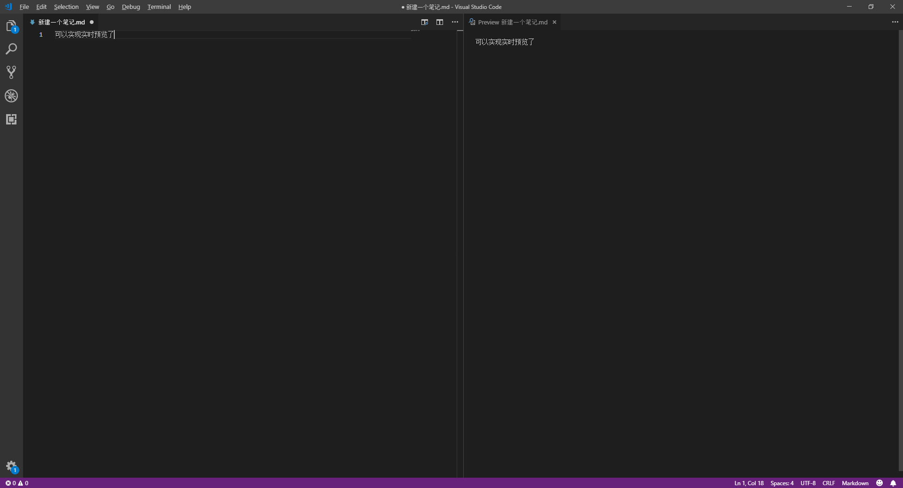

# 用VS COde写MD 文档如何实现实时预览

***作者：小正子***

*目录：无*

**博客地址：https://blog.csdn.net/qq_27307175**

************************
## 一、首先当人是要在本机装好 VS Code，官网自己百度，我这里就不在说了
## 二、然后打开VS code，新建一个后缀名是md的文件：

1. 新建一个.md文件
2. Ctrl + Shift + P,在出现界面输入markdown  
  
3. 在出现的下拉项中选择“Open Preview to the side”，就OK了
